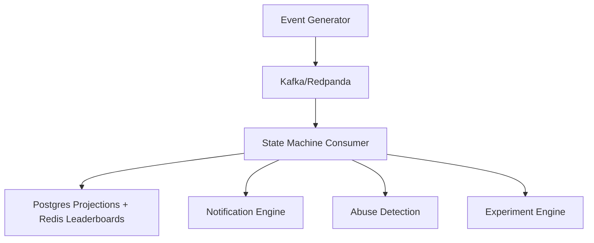

# Gamification, Social Cohort, Notification and Retention Experimentation Engine

An event-sourced gamification engine with XP/streaks/quests, Redis leaderboards, notification engine with quiet hours and fatigue caps, experiment engine with bandit allocation, and rule-based abuse detection — all built on Kafka/Redpanda CQRS pipeline for deterministic replay.

## Architecture



## Documentation

- [Problem Boundaries](docs/problem-boundaries.md)
- [Literature and Landscape Analysis](docs/literature-landscape.md)
- [Metrics Framework](docs/metrics-framework.md)
- [Traceability Matrix and Acceptance Tests](docs/traceability-matrix.md)

The architecture diagram above is the repository's single high-level architecture description. There is no separate architecture document, to avoid duplicate or conflicting descriptions.

## ADRs

- [ADR-0001: Event Pipeline vs. PostgreSQL Outbox](docs/adr/0001-event-sourcing-vs-outbox.md)
- [ADR-0002: Kafka/Redpanda Event Pipeline vs. PostgreSQL](docs/adr/0002-kafka-redpanda-vs-postgres.md)
- [ADR-0003: Rule-Based Abuse Detection](docs/adr/0003-rule-based-abuse-detection.md)
- [ADR-0004: Contextual Bandit vs. Fixed A/B](docs/adr/0004-bandit-vs-fixed-ab.md)

## How to Run Locally

1. Create and activate a Python 3.11+ virtual environment.
2. Install the project and its development dependencies defined in `pyproject.toml`:

   ```bash
   python -m pip install -e ".[dev]"
   ```

3. Run the scaffold acceptance tests:

   ```bash
   python -m pytest
   ```

Kafka/Redpanda, Redis, and PostgreSQL setup instructions will be added when ingestion (M1) is implemented.

## Milestone Status

| Milestone | Description | Status |
|-----------|-------------|--------|
| M1 | Peak-load ingestion & idempotency | ☐ |
| M2 | State rebuild & recovery | ☐ |
| M3 | Leaderboard consistency & latency | ☐ |
| M4 | Experimentation engine | ☐ |
| M5 | Notification reliability & DLQ routing | ☐ |
| M6 | Abuse detection efficacy | ☐ |
| M7 | Integration & recovery drill | ☐ |
| M8 | Full event-log replay / end-to-end rebuild | ☐ |
