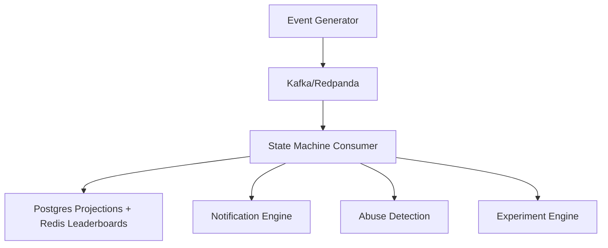

# Gamification, Social Cohort, Notification and Retention Experimentation Engine

An event-sourced gamification engine with XP/streaks/quests, Redis leaderboards, notification engine with quiet hours and fatigue caps, experiment engine with bandit allocation, and rule-based abuse detection — all built on Kafka/Redpanda CQRS pipeline for deterministic replay.

## Architecture



We start with one process and one durable event store, reusing an existing event-sourcing library, and build a deterministic rule-based baseline first. Kafka, independent consumers and adaptive policies are retained only if an early runnable comparison shows they are worth their operational costs.

## Documentation

- [Problem Boundaries](docs/problem-boundaries.md)
- [Literature and Landscape Analysis](docs/literature-landscape.md)
- [Metrics Framework](docs/metrics-framework.md)
- [Traceability Matrix and Acceptance Tests](docs/traceability-matrix.md)
- [Event Contracts](docs/event-contracts.md)

The architecture diagram above is the repository's single high-level architecture description. There is no separate architecture document, to avoid duplicate or conflicting descriptions.

## ADRs

- [ADR-0001: Event Pipeline vs. PostgreSQL Outbox](docs/adr/0001-event-sourcing-vs-outbox.md)
- [ADR-0002: Kafka/Redpanda Event Pipeline vs. PostgreSQL](docs/adr/0002-kafka-redpanda-vs-postgres.md)
- [ADR-0003: Rule-Based Abuse Detection](docs/adr/0003-rule-based-abuse-detection.md)
- [ADR-0004: Fixed A/B with Optional Bandit](docs/adr/0004-bandit-vs-fixed-ab.md)

## How to Run Locally

1. Create and activate a Python 3.11+ virtual environment.
2. Install the project and its development dependencies defined in `pyproject.toml`:

   ```bash
   python -m pip install -e ".[dev]"
   ```

3. Run the tests:

   ```bash
   python -m pytest
   ```

Kafka/Redpanda, Redis, and PostgreSQL setup instructions will be added when ingestion (M1) is implemented.

## Milestone Status

| Milestone | Description | Status |
|-----------|-------------|--------|
| M1 | Canonical engagement events | ☐ (Updated schemas for all the events) |
| M2 | Deterministic gamification | ☑ (slice done: XP, streak/freezes, one quest, one badge, replay) |
| M3 | Cohorts and leaderboards | ☐ |
| M4 | Intervention/quest policy | ☐ |
| M5 | Multi-channel notifications | ☐ |
| M6 | Abuse detection | ☐ |
| M7 | Experimentation and metrics | ☐ |
| M8 | Scale and recovery | ☐ |

M1 means events from the learning app are validated against versioned schemas before acceptance (currently only `lesson_completed` is ingested), while M2 means XP, streaks, freezes, one quest, and one badge are computed deterministically and can be rebuilt exactly from the event history.
