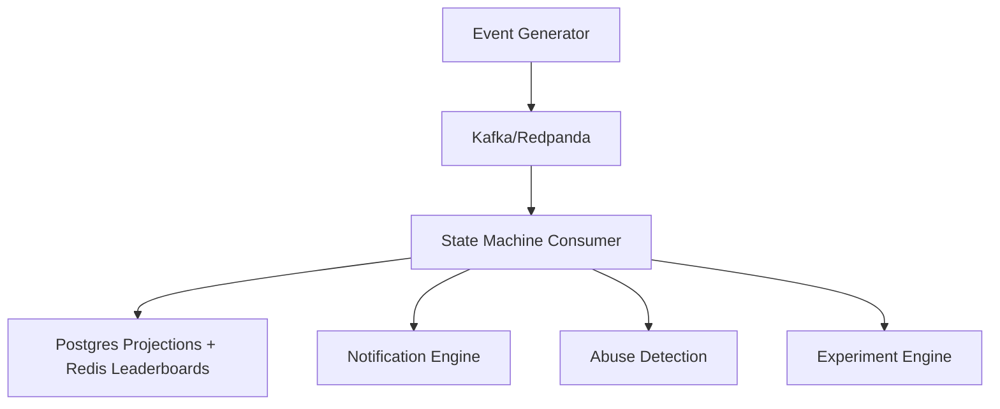

# Gamification, Social Cohort, Notification and Retention Experimentation Engine

An event-sourced gamification engine with XP/streaks/quests, Redis leaderboards, notification engine with quiet hours and fatigue caps, experiment engine with bandit allocation, and rule-based abuse detection — all built on Kafka/Redpanda CQRS pipeline for deterministic replay.

## Architecture

## Documentation
- [Problem Boundaries](docs/problem-boundaries.md)
- [Architecture](docs/architecture.md)

## ADRs
- [ADR-001](docs/adr/001-example.md)

## How to Run Locally
Setup instructions will be added.

## Milestone Status

| Milestone | Description | Status |
|-----------|-------------|--------|
| M1 | Peak-load ingestion & idempotency | ☐ |
| M2 | State rebuild & recovery | ☐ |
| M3 | Leaderboard consistency & latency | ☐ |
| M4 | Experimentation engine | ☐ |
| M5 | Notification reliability & DLQ routing | ☐ |
| M6 | Abuse detection efficacy | ☐ |
| M7 | Integration & recovery drill | ☐ |
| M8 | Full event-log replay / end-to-end rebuild | ☐ |
